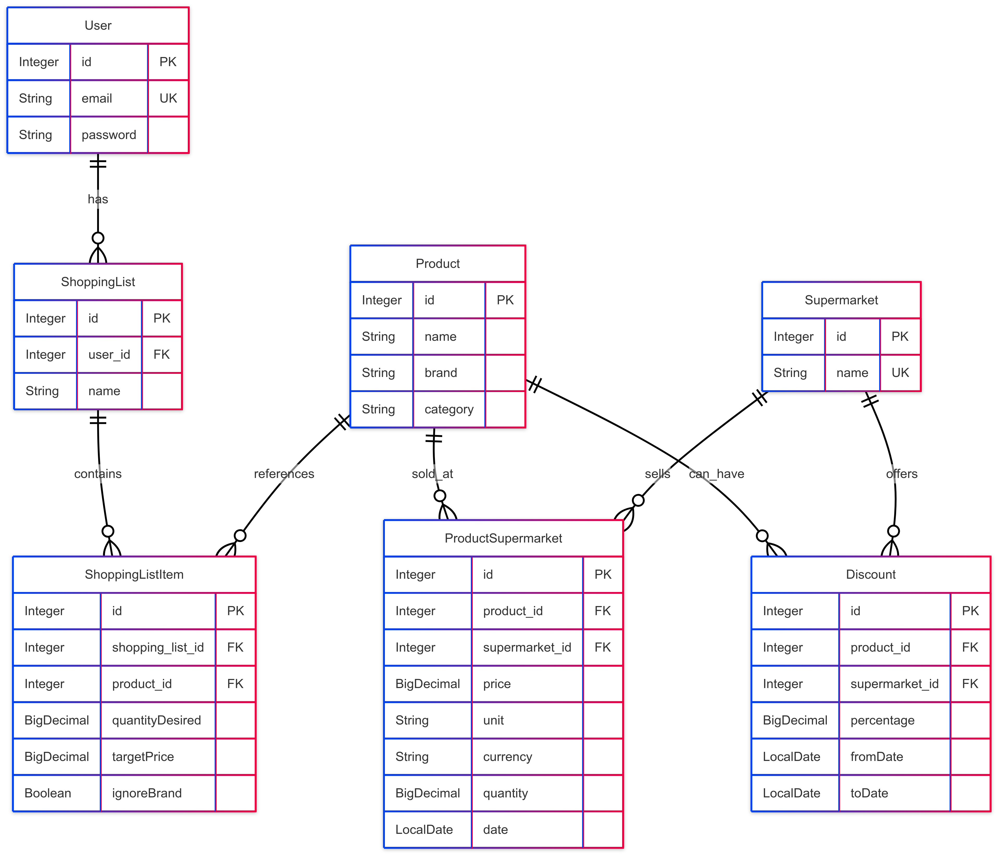

# Price Comparator - Market Backend

The Price Comparator is a backend service designed to help users make informed decisions and save money on their everyday grocery shopping. It enables price comparisons of grocery items across various supermarket chains (e.g., Lidl, Kaufland, Profi). Key functionalities include allowing users to track historical price changes for products, discover the best current deals and discounts, and efficiently manage their personal shopping lists. 

This document outlines the features and API endpoints for the project.

## Project structure overview
*   **`spring-boot/spring-boot/`**: The root directory for the Spring Boot application.
    *   **`src/main/java/com/example/spring_boot/`**: Contains the main Java source code.
        *   **`Application.java`**: The main entry point for the Spring Boot application.
        *   **`Controller/`**: Controller classes that handle incoming HTTP requests.
        *   **`DTO/`**: Data Transfer Objects used for transferring data between layers Controller-Service, especially for API responses. The files with postfix 'request' are used to map the POST request body. 
        *   **`Mapper/`**: Contains MapStruct mappers for converting between DTOs and Model entities.
        *   **`Model/`**: JPA entities representing the database tables.
        *   **`Repository/`**: JPA repositories for database interactions.
        *   **`Services/`**: Business logic and direct interactions with repositories.
    *   **`src/main/resources/`**:
        *   **`application.properties`**: Configuration file for Spring Boot, including database connection details.
        *   **`data/`**: Contains uploaded CSV files.
    *   
    *   **`pom.xml`**: Maven dependencies and build configuration.
*   **`assests/`**: Contains assets like the database diagram image.

## Building and running the application

### Prerequisites

*   Java JDK (Version 17 or later, as specified in `pom.xml`)
*   Apache Maven
*   PostgreSQL database server
*   Optionally - PgAdmin for visualising database tables

### Database Setup
- Download PostgreSQL server and set as username the value from spring.datasource.username variable and password from spring.datasource.password variable, all set in application.properties file
- Create a database named "price_comparator_db"
- If you want to change the credentials or database name, update application.properties

### Build Instructions

- In terminal, navigate to the spring-boot/spring-boot/ directory
- Build the project with Maven: .\mvnw.cmd clean install

### Running the Application
- Check if the build was successful: in target/ folder should have appeared a file with JAR extension (ex:spring-boot-0.0.1-SNAPSHOT.jar)
- After this, you can run the JAR directly:
java -jar target/spring-boot-0.0.1-SNAPSHOT.jar
- The server application will run at http://localhost:8080

## Database diagram




## Technical Stack

*   **Build Tool:** Maven
*   **Framework:** Spring Boot
*   **Database:** PostgreSQL

## CSV parsing

### Parse CSV file endpoint
This endpoint processes CSV file to populate the database with Product, ProductSupermarket, Discount, and Supermarket information.

**Base URL:** `http://localhost:8080`


*   **Endpoint template:** `POST {{base_url}}/csv/parse-CSV`
*   **Request Body:**
    ```json
    {
        "filename": "CSV file name"
    }
    ```
*   **Request parameter:**
    *   `filename` (String): The name of the CSV file
*   **File naming conventions:**
    *   For general product data: `supermarketName_YYYY-MM-DD.csv` (ex: `penny_2025-05-22.csv`)
    *   For discount data: `supermarketName_discounts_YYYY-MM-DD.csv`
*   **NOTE:** CSV files must be placed in the `src/main/resources/data/` directory of the project for successful parsing

## 1. Daily Shopping Basket Monitoring
Help users split their basket into shopping lists that optimise for cost savings

### Create user endpoint
To enable shopping list storage, users need to begin by creating an account
*   **Endpoint example:** `POST {{base_url}}/user/add-user?email=mircea&pass=1234`

*   **Query parameters:**
    *   `email` (String): The email for the new user's account
    *   `pass` (String): The password for the user's account
### Create shopping list endpoint
*   **Endpoint template:** `POST {{base_url}}/shopping-list/create`
*   **Request Body:**
    ```json
    {
        "name": "Shopping list name",
        "user_id": "userID"
    }
    ```
*   **Request parameters:**
    *   `name` (String): The name for the new shopping list
    *   `user_id` (Integer): The ID of the user creating the list

### Add product into shopping list endpoint
*   **Endpoint example:** `POST {{base_url}}/shopping-list/add-item`
*   **Request Body:**
    ```json
    {
        "productId": 8,
        "shoppingListId": 1,
        "quantityDesired": 1,
        "ignoreBrand": true
    }
    ```
*   **Request parameters:**
    *   `productId` (Integer): The ID of the product to add
    *   `shoppingListId` (Integer): The ID of the shopping list
    *   `quantityDesired` (Integer or real): The desired quantity of the product
    *   `ignoreBrand` (Boolean, Optional, Default: `false`): If `true`, the brand is ignored when searching for deals. This parameter is primarily utilized by the "Split shopping list for cost savings" feature
*   **Note:** I presumed the frontend provides `shoppingListId`, `productId`, and `quantityDesired`. The `quantityDesired` field will be useful in future development if the total price of the shopping list is calculated. The parameter ignoreBrand is used only in the below endpoint and provides user flexibility in finding the best deal by enabling searches based on either a specific product brand or solely on the product name.

### Split shopping list for cost savings endpoint
Retrieves the best deal for each product in the specified shopping list. This evaluation considers current prices after active discounts and respects the user's brand preference if set through ignoreBrand parameter.
*   **Endpoint Example:** `GET {{base_url}}/shopping-list/split-shopping-list?shoppingListId=1`
*   **Query Parameter:**
    *   `shoppingListId` (Integer): The ID of the shopping list to analyze

## 2. Best discounts endpoint
Lists products with the highest current percentage discounts across all tracked stores
*   **Endpoint:** `GET {{base_url}}/discount/best-discounts`
*   **NOTE:** Retrieves a list of products from all supermarkets that currently have active discounts, sorted by the highest discount percentage

## 3. New discounts endpoint
Lists discounts that have been newly added
*   **Endpoint:** `GET {{base_url}}/discount/new-discounts`
*   **NOTE:** Discounts added within the last 24 hours are considered new

## 4. Dynamic price history graphs endpoint
Retrieves product price history records, optionally filtered by supermarket, brand or category. This data can be used to generate price trend visualizations
*   **Endpoint example:** `GET {{base_url}}/price/price-trends?category=lactate&brand=Zuzu&supermarketId=1`
*   **Query parameters (all optional):**
    *   `supermarketId` (Integer): Filter by a specific supermarket
    *   `brand` (String): Filter by a specific brand
    *   `category` (String): Filter by a specific product category
*   **Note:** Price history is constructed by storing the date extracted from the CSV filename during the parsing process

## 5. Product substitutes & recommendations
Highlights "value per unit" (e.g., price per kg, price per liter) to help identify the best buys, even if package sizes differ

### Value per unit by product name endpoint
Returns a list of products matching a given product name, sorted by their best value per unit after considering active discounts
*   **Endpoint example:** `GET {{base_url}}/price/value-per-unit/by-product-name?productName=iaurt grecesc`
*   **Query parameter:**
    *   `productName` (String): The name of the product to search for

### Value per unit for all products endpoint
Returns a list of all products, sorted by their best value per unit after considering active discounts
*   **Endpoint template:** `GET {{base_url}}/price/value-per-unit/all-products`

**Unit conversion assumptions:**
The system uses a simplified set of unit conversions. For future development it would be better to store these in databas in order to add new unit conversions.
*   "g" to "kg" (conversion factor: 0.001)
*   "ml" to "l" (conversion factor: 0.001)
*   "role" to "buc" (conversion factor: 1)
*   "pachet" to "buc" (conversion factor: 1)

## 6. Custom price alerts
Allows users to set a target price for a product. The system aims to identify when a product's price drops to or below that target

### Set target price endpoint
*   **Endpoint example:** `POST {{base_url}}/price/set-target-price`
*   **Request Body:**
    ```json
    {
        "productId": 11,
        "shoppingListId": 1,
        "targetPrice": 4
    }
    ```
*   **Request parameters:**
    *   `productId` (Integer): The ID of the product
    *   `shoppingListId` (Integer): The ID of the shopping list to which the product belongs
    *   `targetPrice` (Integer or real): The desired target price

**Note:**
Regarding price alert feature, a service with a scheduled job is partially implemented. This job runs every minute to:
- Retrieve shopping list items for which a target price has been specified
- Calculate the current price for these products, considering any active discounts
- Identify items priced at or below their set target and store them along the user who placed the item in its shopping list

Further development would involve implementing user notification mechanism
